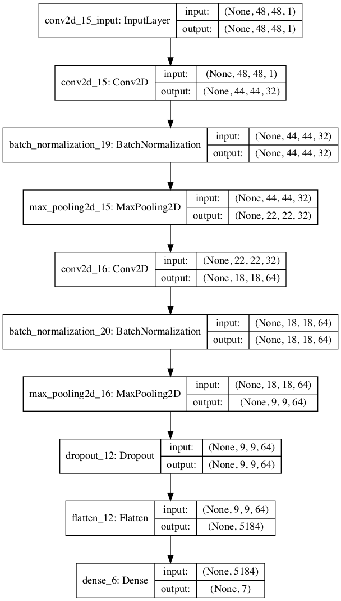

# Facial Emotion Recognition using Images 
This repository contains all the code and relevant files used in Facial Expressions Recognition project under Brain and Cognitive Society. The goal of the project is to correctly recognize 7 fundamental expressions (anger, disgust, happiness, surprise, sadness, fear and neutral) from the images using Convolution neural network.We have tried to implement a research paper, which can be accessed [here](https://drive.google.com/open?id=1qMUhEFLUEuJlHO5SKjULNYfSS25ZSw4a). 

## Dataset
JAFFE and CK+ datasets have been used.

## Preprocessing

1. **Cropping Image**  
_WHY_ : Images were cropped to crop out the irrelevant parts of the face or the background and only have the closeup of face in image which is the region of interest\
_HOW_ : With help of Detector and Predictor variables from the dlib library 68 landmarks were detected for the frontol face. The landmark coordinates for both eyes were used  for rotating image to align the face horizontally for accurate cropping. The images in the training set are randomly flipped and rotated to increase the data set.
1. **Equilization** : Equilization was performed using openCV on the cropped and rotated images to equalize the intensities
1. **Normalization** : All the images were normalized with z-score method to get the data distribution centered at zero.The formula for the same is:
[(value - mean)/standard deviation]
1. **Downsampling** : The images are downsampled to 48x48 pixels 
1. **Data Augmentation**: The images in the training set are randomly flipped and rotated to increase the data set inorder to avoid overfitting on small data.

## CNN Model (Keras implementation)
* **Architecture** 2 convolutional layers with ReLU activation and 2 max pooling layers are used. The output is then flattened into a 1600x1 vector and connected to an output which uses a softmax activation.
* **Categorical Hyperparameters** We have used momentum optimiser, categorical cross entropy function and accuracy as metrics. We have used ten cross validation method for evaluation of our model.
* **Numerical Hyperparameters**
Batch size is 16, learning rate (eta) is 0.001 and no. of epochs are 80 to 100.

## Architecture of The Model

# emotion_recognition
